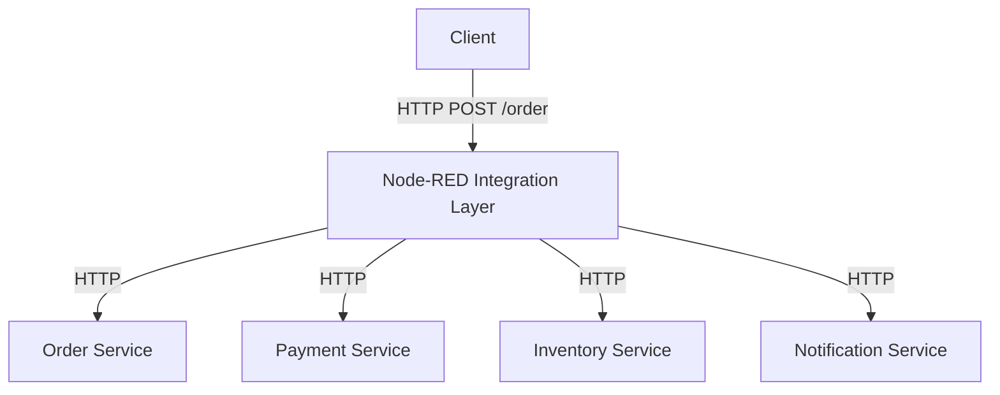

# System Context Diagram

```mermaid
graph TD

Client[Client]

NodeRed[Node-RED Integration Layer]

Order[Order Service]
Payment[Payment Service]
Inventory[Inventory Service]
Notify[Notification Service]

Client -->|HTTP POST /order| NodeRed
NodeRed -->|HTTP| Order
NodeRed -->|HTTP| Payment
NodeRed -->|HTTP| Inventory
NodeRed -->|HTTP| Notify
```