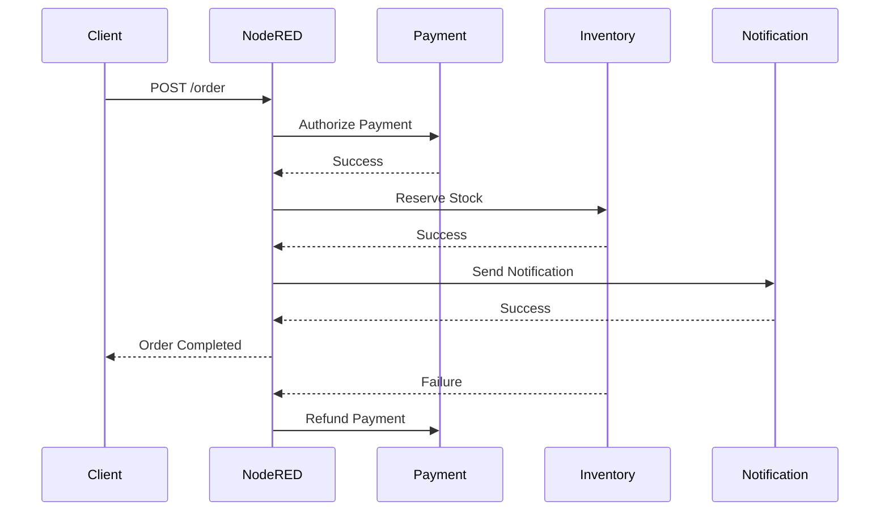

# Orchestration Flow Diagram

```mermaid
sequenceDiagram

participant Client
participant NodeRED
participant Payment
participant Inventory
participant Notification

Client->>NodeRED: POST /order
NodeRED->>Payment: Authorize Payment
Payment-->>NodeRED: Success

NodeRED->>Inventory: Reserve Stock
Inventory-->>NodeRED: Success

NodeRED->>Notification: Send Notification
Notification-->>NodeRED: Success

NodeRED-->>Client: Order Completed

Inventory-->>NodeRED: Failure
NodeRED->>Payment: Refund Payment
```